# WorkFlow360

An internal business application for a small-to-mid-size company: employees and departments, projects and tasks,
attendance, leave with approvals, in-app notifications and an audit trail. Built with **ASP.NET Core 8**,
**Entity Framework Core**, **SQL Server** and **Angular**.

It's deliberately more than CRUD. Leave requests count only working days and check balances *including* pending
requests, tasks follow a status workflow with different rights for assignees and project managers, attendance is
derived per day from check-ins, leave and holidays, and every important action is audited.

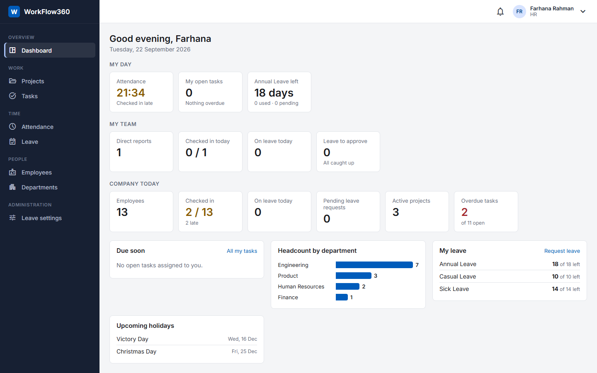

## Contents

- [Features](#features)
- [Tech stack](#tech-stack)
- [Architecture](#architecture)
- [Database](#database)
- [API](#api)
- [Screenshots](#screenshots)
- [Running locally](#running-locally)
- [Configuration](#configuration)
- [Testing](#testing)
- [Design decisions](#design-decisions)
- [Future improvements](#future-improvements)

## Features

### Roles

| Role | Can |
|---|---|
| **Admin** | Everything, including user accounts, roles and the audit log |
| **HR** | Manage employees, departments, designations, leave types, holidays and balances; approve leave for people without a manager; see everyone's attendance and leave |
| **Manager** | Create and run projects, assign tasks, approve their direct reports' leave, see their team's attendance |
| **Employee** | Work on assigned tasks, check in/out, request and cancel leave |

### Modules

- **Authentication** – JWT access tokens (15 min, kept in memory in the browser) with rotating refresh tokens in an
  HttpOnly cookie. Reusing an old refresh token revokes every session for that user. Login is rate-limited.
- **People** – employees with department, designation, manager and employment status. No hard deletes: ending
  employment deactivates the user account and signs them out, and is blocked while the person still has direct
  reports or manages open projects. Reporting loops are rejected.
- **Projects & tasks** – project members, task assignment (members only), priorities and due dates, comments and a
  full per-task history. Status workflow `To do → In progress → In review → Done`: assignees move their own work,
  only the project manager can cancel or reopen. A project can't be completed with open tasks; cancelling it
  cancels them.
- **Leave** – yearly balances per leave type. Requests count working days only (configurable weekend + public
  holidays), can't overlap, start in the past or exceed the balance after pending requests. The employee's manager
  approves (HR when there is none); nobody approves their own. Approving re-checks the balance; cancelling
  approved future leave gives the days back. HR manages leave types, holidays and allocations, and opens a new
  leave year in one click.
- **Attendance** – one check-in/out per day, late after start time + grace period (company time zone), no check-in
  on approved leave. Monthly view per employee and a team summary for managers and HR.
- **Dashboard** – one call, role-aware: "my day" for everyone with an employee record, team figures and project
  progress for managers, company figures and headcount for HR/Admin.
- **Notifications** – in-app, for assignments, status changes, comments and leave decisions. The bell polls the
  unread count once a minute, only while the tab is visible.
- **Audit log** – sign-ins (including failed ones), user and employee changes, leave decisions, task assignment and
  project changes, filterable by action, user and date.

## Tech stack

| | |
|---|---|
| **Backend** | C# / .NET 8, ASP.NET Core Web API, Entity Framework Core 8, SQL Server, FluentValidation, Serilog, Swagger |
| **Auth** | JWT bearer tokens, refresh token rotation, ASP.NET Core Identity's PBKDF2 password hasher (without the Identity schema) |
| **Frontend** | Angular 21 (standalone components, signals), Angular Material, RxJS, Reactive Forms |
| **Tests** | xUnit with in-memory SQLite (77 tests), Vitest for the Angular auth interceptor |
| **Tooling** | Visual Studio / VS Code, SSMS, Postman, Git |

No Docker, message queues or caches: nothing in the requirements needs them yet, and each would add operational
cost to explain rather than value.

## Architecture

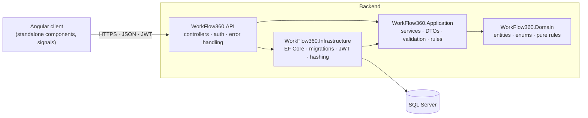

- **Domain** has no dependencies. Pure business rules that are easy to unit-test live here
  (`TaskWorkflow`, `WorkingDays`).
- **Application** holds one service per feature (`LeaveService`, `TaskService`, ...) with its DTOs and validators
  in the same folder. Services use EF Core through a small `IAppDbContext` interface — there is no repository layer
  on top of EF, and no MediatR or AutoMapper.
- **Infrastructure** implements `IAppDbContext`, token creation and password hashing.
- **API** is thin: controllers, JWT setup, a validation filter and one exception handler that turns business
  exceptions into RFC 7807 ProblemDetails (`400` rule broken, `403`, `404`, `409` conflict).

```
Backend/
  WorkFlow360.API/             Controllers, Middleware, Filters, Extensions, Program.cs
  WorkFlow360.Application/     Attendance, Auth, AuditLogs, Dashboard, Employees, Leave,
                               Notifications, Organisation, Projects, Tasks, Users, Common
  WorkFlow360.Domain/          Entities, Enums, Rules
  WorkFlow360.Infrastructure/  Persistence (DbContext, Configurations, Migrations, Seed), Auth
  WorkFlow360.Tests/           One folder per feature
Frontend/workflow360-angular/src/app/
  core/                        auth service, interceptors, guards, toast
  layout/                      shell, sidebar, notification bell
  shared/                      page header, status badge, stat tile, confirm dialog, paging helpers
  features/                    one folder per module (pages, dialogs, service, models)
docs/                          design notes, screenshots, Postman collection
```

## Database

SQL Server, code-first EF Core migrations. Enums are stored as text so the data is readable in SSMS, business dates
use `date` and every timestamp is UTC.

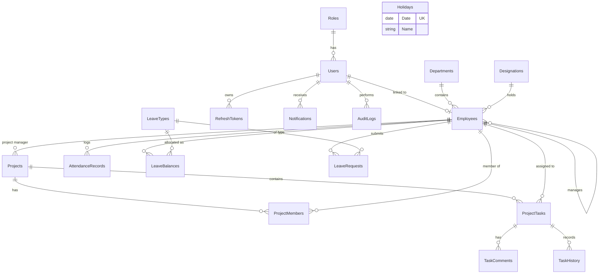

Notable constraints and indexes:

- Unique: user email, employee code and email, department code/name, project code, `(EmployeeId, WorkDate)` for
  attendance, `(EmployeeId, LeaveTypeId, Year)` for balances, and a filtered unique index on `Employees.UserId`.
- Composite indexes for the common queries: tasks by `(ProjectId, Status)`, `(AssigneeId, Status)` and
  `(Status, DueDate)` for overdue work; leave by `(EmployeeId, Status)`; notifications by `(UserId, IsRead, CreatedAt)`.
- Check constraints: end date ≥ start date on projects and leave, `UsedDays ≥ 0`.
- Delete behaviour is `Restrict` except for owned children (project members, task comments/history, refresh tokens).
- `LeaveRequest.Status` and `LeaveBalance.UsedDays` are optimistic concurrency tokens.

## API

Swagger UI: `http://localhost:5080/swagger`. A Postman collection with every endpoint is in
[`docs/postman`](docs/postman/WorkFlow360.postman_collection.json) — run **Auth / Login** first and the token is
stored for the other requests.

All endpoints need a bearer token except login, refresh and logout. List endpoints take `page`, `pageSize`
(max 100), `search`, `sortBy`, `sortDirection` and return `{ items, page, pageSize, totalCount }`.

| Endpoint | Who |
|---|---|
| `POST /api/auth/login` · `/refresh` · `/logout` · `GET /api/auth/me` | Anyone / signed in |
| `GET /api/dashboard` | Signed in — sections depend on the role |
| `GET /api/employees` · `/{id}` · `/lookup` | Signed in |
| `POST /api/employees` · `PUT /api/employees/{id}` | Admin, HR |
| `GET /api/departments` · `GET /api/designations` | Signed in |
| `POST`/`PUT /api/departments` · `POST`/`PUT /api/designations` | Admin, HR |
| `GET`/`POST /api/users` · `PUT /api/users/{id}` · `PUT /api/users/{id}/password` | Admin |
| `GET /api/projects` · `/{id}` · `/{id}/tasks` | Project members (Admin/HR see all) |
| `POST /api/projects` | Admin, Manager |
| `PUT /api/projects/{id}` · `POST`/`DELETE /api/projects/{id}/members` | Admin, the project's manager |
| `GET /api/tasks` · `/{id}` · `GET`/`POST /{id}/comments` · `GET /{id}/history` | Project members |
| `POST /api/tasks` · `PUT /api/tasks/{id}` | Admin, the project's manager |
| `PUT /api/tasks/{id}/status` | The assignee or the project's manager |
| `GET /api/leaves?scope=mine\|approvals\|team` · `/my-balances` · `/preview` | Signed in |
| `POST /api/leaves` · `PUT /api/leaves/{id}/cancel` | The employee |
| `PUT /api/leaves/{id}/approve` · `/reject` | The employee's manager; HR when there is none; Admin |
| `GET /api/leave-types` · `GET /api/holidays` | Signed in |
| `POST`/`PUT /api/leave-types` · `POST`/`DELETE /api/holidays` · `/api/leave-balances` | Admin, HR |
| `GET /api/attendance/today` · `POST /check-in` · `POST /check-out` · `GET /month` | The employee |
| `GET /api/attendance/team` · `GET /api/attendance/employees/{id}/month` | Managers (direct reports), HR, Admin |
| `GET /api/notifications` · `/unread-count` · `PUT /{id}/read` · `PUT /read-all` | Signed in (own only) |
| `GET /api/audit-logs` · `/actions` | Admin |

Errors are ProblemDetails, for example:

```json
{
  "title": "Request could not be completed",
  "status": 400,
  "detail": "Not enough Annual Leave: 14 day(s) available (after pending requests), 32 requested."
}
```

## Screenshots

| | |
|---|---|
| 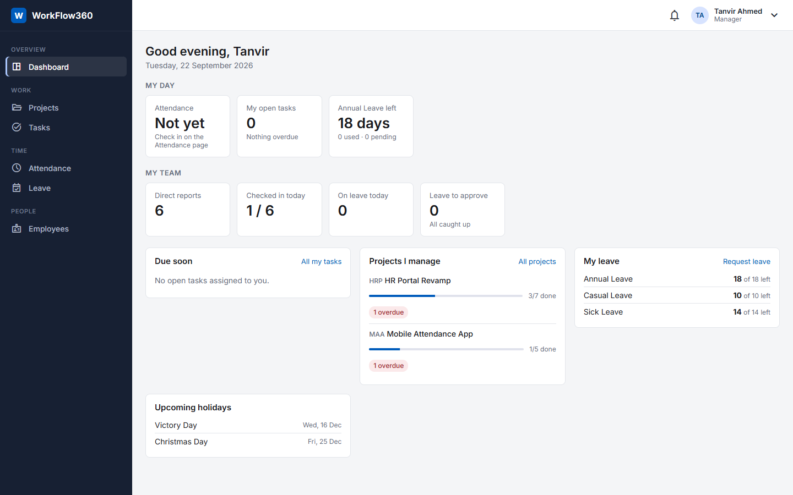 Manager dashboard | 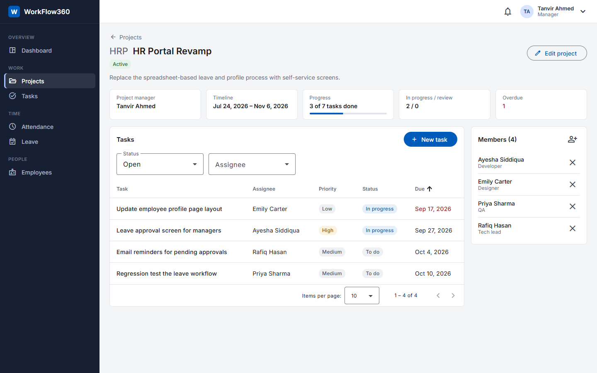 Project with tasks and members |
| 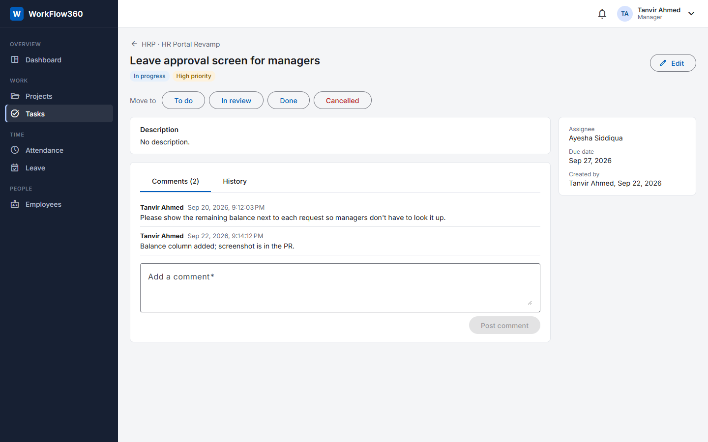 Task: status actions, comments, history | 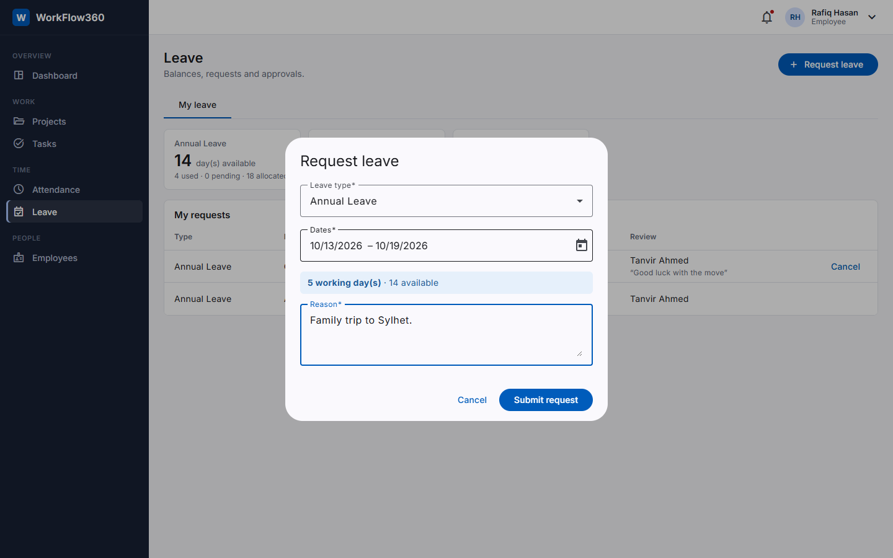 Leave request with live working-day count |
| 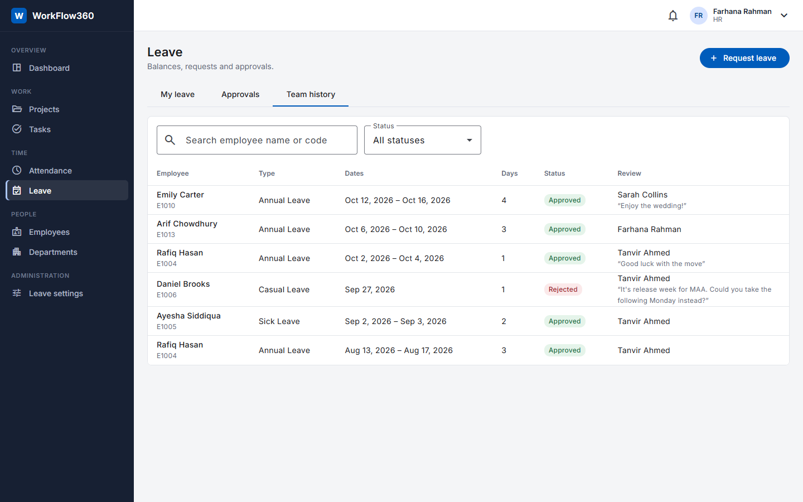 Team leave history | 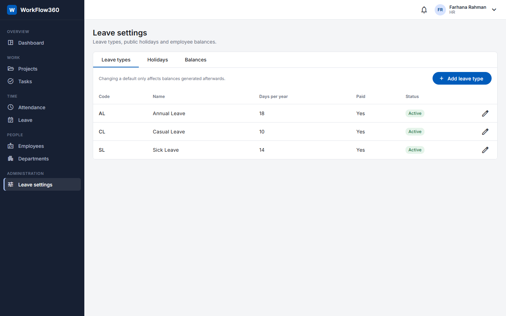 HR leave settings |
| 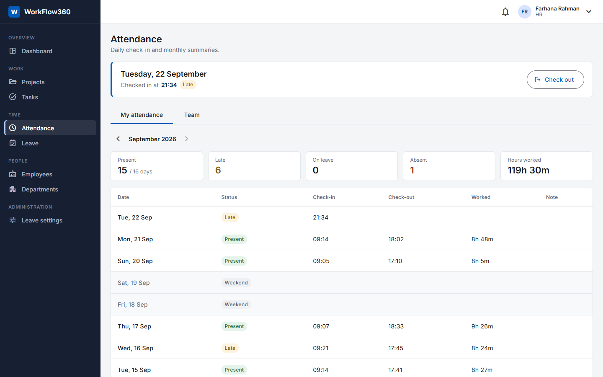 Attendance: today and this month | 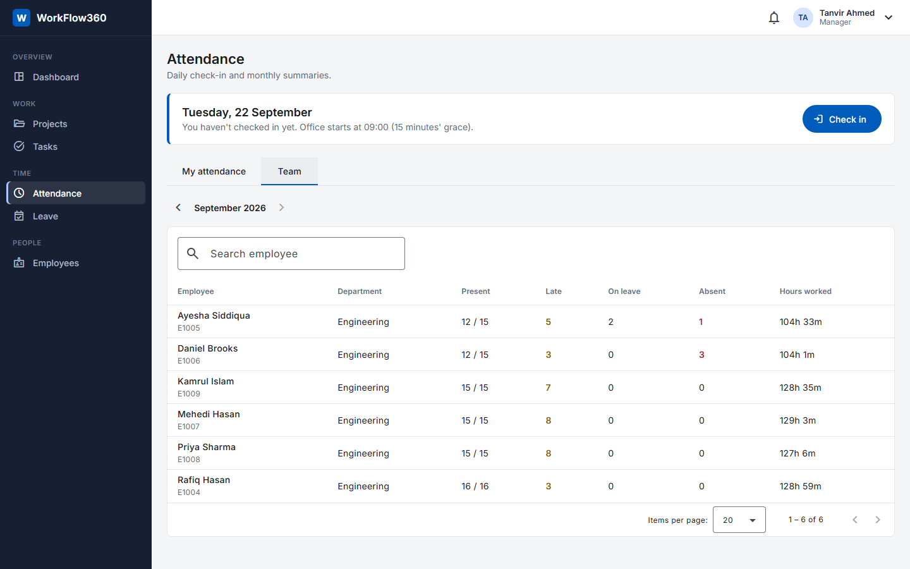 Team attendance |
| 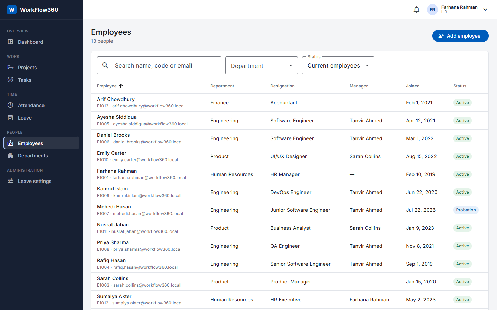 Employees | 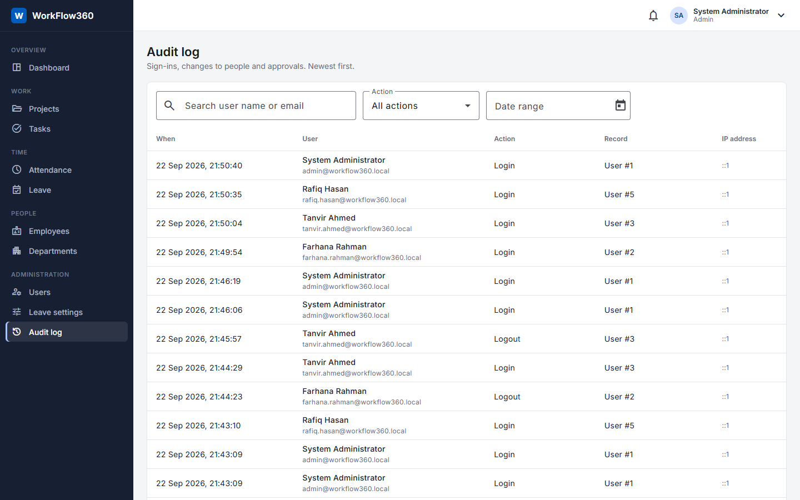 Audit log |
| 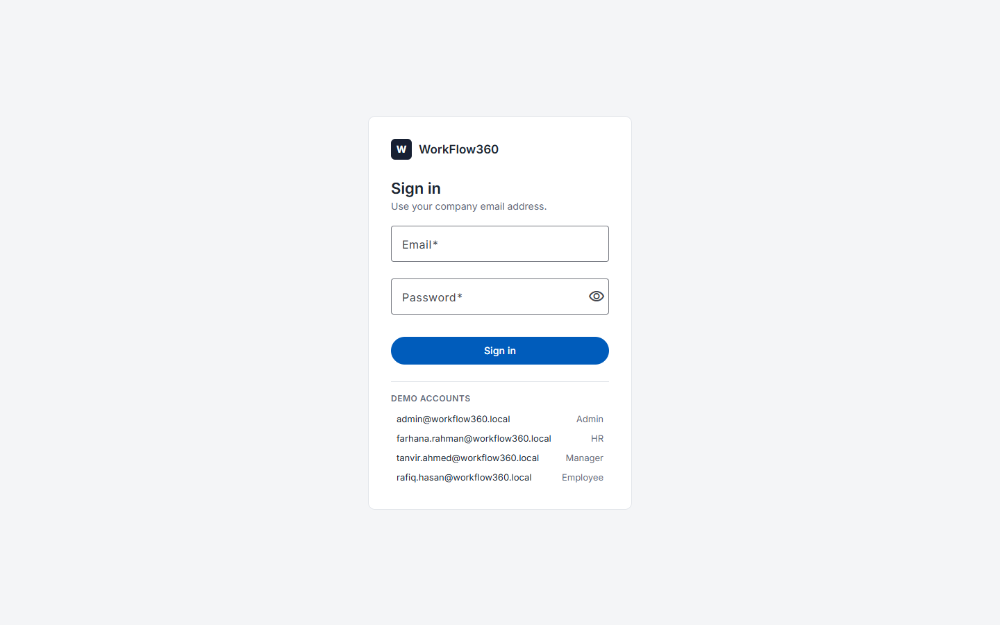 Sign in | 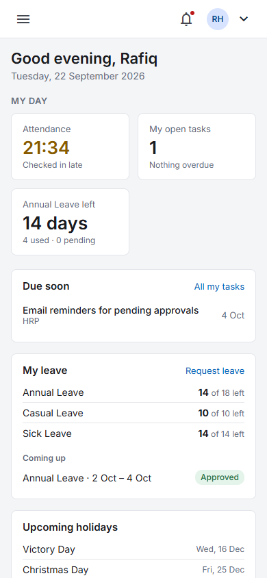 Phone layout |

## Running locally

**Requirements:** .NET 8 SDK (a newer SDK can build `net8.0` too), SQL Server (Express, Developer or LocalDB),
Node.js 20.19+ or 22.12+.

### 1. Database and API

```bash
cp Backend/WorkFlow360.API/appsettings.Development.example.json Backend/WorkFlow360.API/appsettings.Development.json
# edit ConnectionStrings:DefaultConnection and set Jwt:SigningKey to a random string (32+ characters)

dotnet tool restore
cd Backend/WorkFlow360.API
dotnet run --launch-profile http
```

In Development the API applies migrations and seeds demo data on startup (organisation, projects and tasks, leave
history and about five weeks of attendance). To create the database without starting the API:

```bash
dotnet ef database update -p Backend/WorkFlow360.Infrastructure -s Backend/WorkFlow360.API -- --environment Development
```

Swagger: http://localhost:5080/swagger · Health check: http://localhost:5080/health

### 2. Angular client

```bash
cd Frontend/workflow360-angular
npm ci
npm start
```

Open http://localhost:4200. The dev server proxies `/api` to port 5080, so the browser sees one origin and the
HttpOnly refresh cookie works without CORS configuration.

### Demo accounts

All use the password `Passw0rd!` (development seed data only). The login page lists them in development builds.

| Email | Role | Good for trying |
|---|---|---|
| admin@workflow360.local | Admin | Users, audit log (no employee record) |
| farhana.rahman@workflow360.local | HR | Company dashboard, employees, leave settings, approving leave for people without a manager |
| tanvir.ahmed@workflow360.local | Manager | Projects and tasks, approving his team's leave, team attendance |
| sarah.collins@workflow360.local | Manager | A second team |
| rafiq.hasan@workflow360.local | Employee | Own tasks, leave requests, check-in |
| arif.chowdhury@workflow360.local | Employee | No manager — his leave goes to HR |

## Configuration

`appsettings.json` holds everything except secrets; the connection string and JWT signing key go in the
git-ignored `appsettings.Development.json` (or user secrets / environment variables in other environments).

| Setting | Default | Purpose |
|---|---|---|
| `Company:TimeZone` | `Asia/Dhaka` | Defines "today" for overdue tasks, leave and attendance |
| `Company:WeekendDays` | `["Friday", "Saturday"]` | Non-working days for leave and attendance |
| `Attendance:OfficeStartTime` / `GraceMinutes` | `09:00` / `15` | Late check-in threshold |
| `Jwt:AccessTokenMinutes` / `RefreshTokenDays` | `15` / `7` | Token lifetimes |
| `Serilog` | console + daily rolling file | Logging |

## Testing

```bash
dotnet test                                   # 77 backend tests
cd Frontend/workflow360-angular && npm test -- --watch=false
```

Backend tests run the real services against **in-memory SQLite** built from the real EF model, so unique indexes,
foreign keys, check constraints and concurrency tokens are enforced (the EF InMemory provider ignores them), and use
`FakeTimeProvider` to control dates. They focus on business rules rather than coverage numbers:

- **Auth** – token rotation, reuse detection with a grace window, expiry, inactive accounts.
- **Employees & users** – reporting loops, ending employment, admin lock-out protection.
- **Tasks & projects** – the status workflow, who may change what, notifications, closing projects.
- **Leave** – working-day counting, balance including pending requests, overlaps, self-approval, cancelling,
  and two reviewers acting at the same time.
- **Attendance** – late detection, day statuses for a whole month, team visibility.
- **Dashboard & notifications** – role-dependent sections, users only ever seeing their own notifications.

The Angular tests cover the auth interceptor: attaching tokens, refreshing once on `401`, sharing one refresh
between parallel requests, and signing out when the refresh fails.

## Design decisions

The reasoning behind the main choices is in [docs/design-notes.md](docs/design-notes.md). The short version:

- **Layered, not over-layered.** Services use EF Core directly through one interface; business errors are
  exceptions mapped to ProblemDetails in one place.
- **Access token in memory, refresh token in an HttpOnly cookie** with rotation and reuse detection.
- **Explicit audit entries** written in the same transaction as the change they describe.
- **Derived data isn't stored.** Pending leave days and attendance statuses (absent, on leave, holiday) are
  computed when needed, so they can't drift out of sync.
- **Optimistic concurrency** instead of locks for leave approvals.
- **Everything scales with indexes, not caching:** set-based queries, server-side paging, cheap polling.

## Future improvements

- Real-time notifications with SignalR instead of polling.
- Email notifications for leave decisions and task assignment.
- Kanban board with drag and drop for tasks.
- Pro-rated leave allocation for people who join mid-year, and carry-over rules.
- File attachments (sick-leave certificates, task files).
- Password change / reset by email, and multi-factor sign-in.
- CI pipeline running both test suites on every push.
- Docker Compose for one-command local setup.
